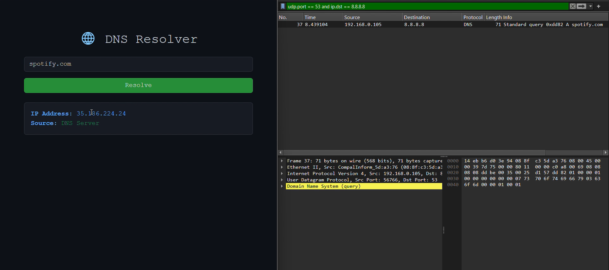
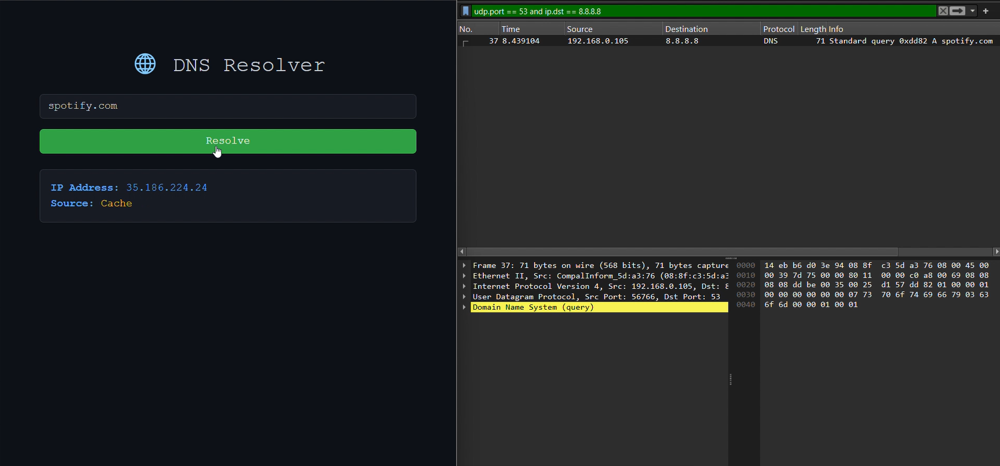
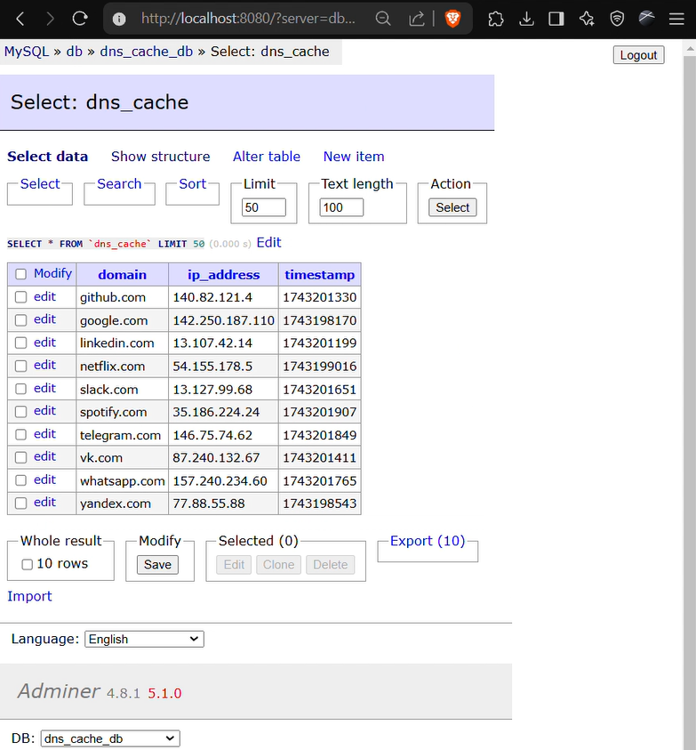
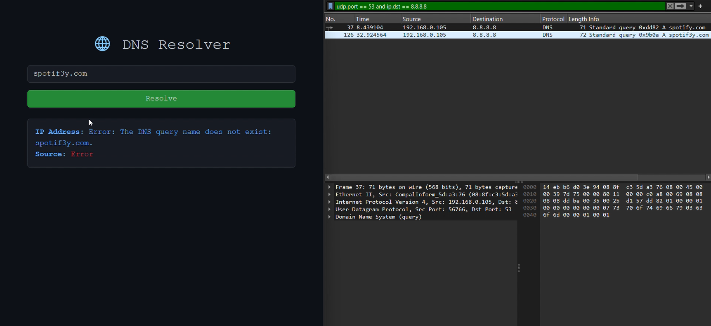

# 🧠 DNS Resolver with Caching

A simple DNS resolver built using Python and Flask, featuring DNS caching with MySQL, and tested using Wireshark.

---

## 📌 Project Overview

This web-based DNS Resolver accepts domain names, resolves them to IP addresses using DNS servers (via `dnspython`), and caches the results in a MySQL database.

- ✅ Web interface built with Flask  
- ✅ DNS queries made with `dnspython`  
- ✅ Cache implemented with MySQL (via Docker)  
- ✅ TTL support (default: 60 seconds)  
- ✅ Adminer for DB inspection  
- ✅ Verified using **Wireshark**

---

## 🛠️ Technologies Used

| Layer         | Tools / Tech                |
|---------------|-----------------------------|
| Backend       | Python, Flask               |
| DNS Resolver  | dnspython                   |
| Database      | MySQL (Docker), pymysql     |
| Admin Panel   | Adminer                     |
| Frontend      | HTML, Bootstrap (Dark Theme)|
| Dev Tools     | Docker, Wireshark           |

---

## 🧩 Project Structure

```plaintext
dns_resolver_project/
├── app.py              # Flask application
├── cache.py            # Cache logic (MySQL)
├── requirements.txt    # Python dependencies
├── docker-compose.yml  # DB + Adminer
├── templates/
│   └── index.html      # Web interface
├── images/
│   ├── first.png
│   ├── ...
│   └── last.png
└── README.md           # Documentation
```

---

## 🚀 How to Run the Project

### 1. Clone the Repo

```bash
git clone https://github.com/yourname/dns-resolver
cd dns-resolver
```

### 2. Set Up Database (Docker)

```bash
docker-compose up -d
```

- Access Adminer at: http://localhost:8080
- Login with:
  - User: root
  - Password: 4444
  - Database: (create dns_cache_db manually)

- Then Run this manually in Adminer or MySQL client

```bash
CREATE DATABASE dns_cache_db;
USE dns_cache_db;
CREATE TABLE dns_cache (
    domain VARCHAR(255) PRIMARY KEY,
    ip_address VARCHAR(50),
    timestamp BIGINT
);
```

### 3. Install Dependencies

```bash
pip install -r requirements.txt
```

### 4. Run Flask App

```bash
python app.py
```

Open in browser: http://localhost:5000

---

## 🌐 Features

- Real-time DNS resolution
- Automatic cache with TTL
- No repeated DNS queries if result exists in cache
- Visual feedback on source:

  - 🟩 DNS server
  - 🟨 Cache
  - 🟥 Error

---

## 🔬 Wireshark Verification

1. Start Wireshark with filter:

    ```plaintext
    dns && udp.port == 53
    ```

2. Make initial query (e.g. example.com)

3. Observe DNS packet in Wireshark

4. Make the same query again

5. ✅ No second DNS packet → result fetched from cache

---

## 🧪 Example Screenshots

### 1️⃣ Initial query → DNS server packet



### 2️⃣ Cached query → No DNS packet



### 3️⃣ Adminer: cache visible in DB



### 4️⃣ Fake domain → Error handled correctly



### 5️⃣ Full Process Demo (Video)

🎥 Watch the full process — from query to caching and Wireshark capture — in this short video:

[📎 View on Google Drive](https://drive.google.com/file/d/1JJFzPSitUHsfLTx6jr2oJ6kAJfe4Vp10/view?usp=sharing)

---

## 📚 Learning Outcome

- Understood DNS resolution process
- Implemented a caching mechanism with TTL
- Captured and analyzed DNS traffic with Wireshark
- Containerized database and admin panel using Docker
- Practiced full-stack development using Python

---
